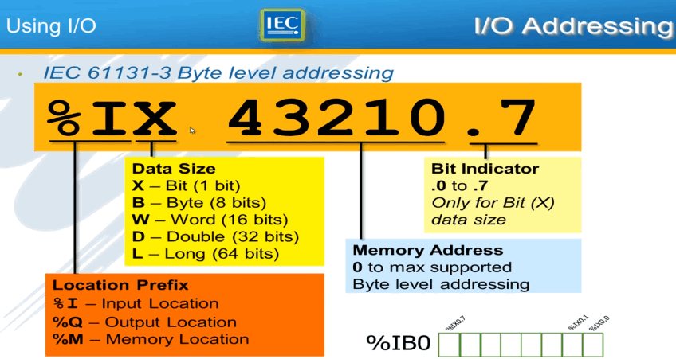
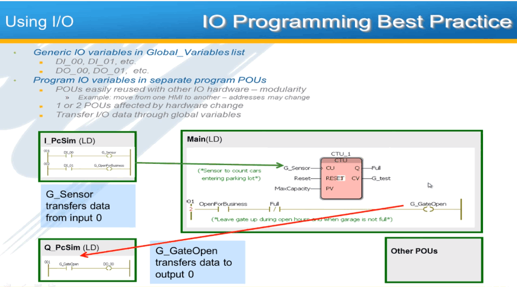
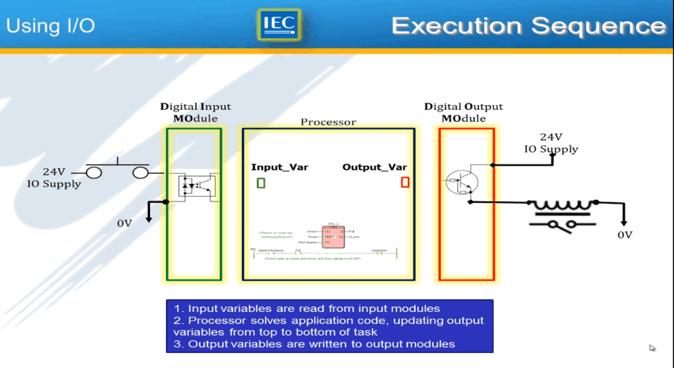
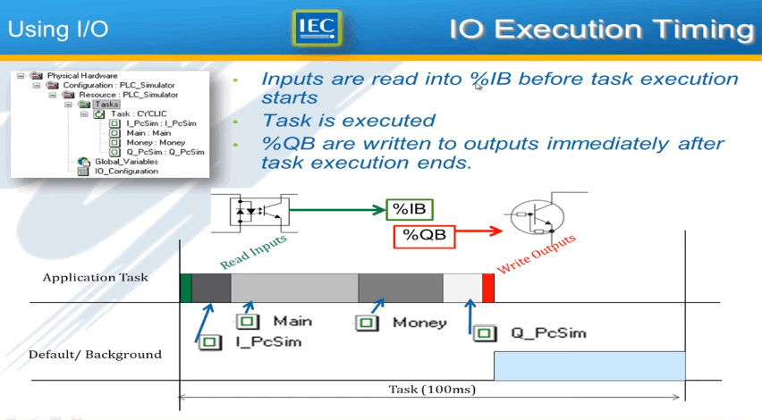

## 1.[Training: IEC 61131-3 Basics with MotionWorks IEC](https://www.youtube.com/playlist?list=PLNAENlyEDCkzMwkIpWNwX0DeJdlVFwyB0)
---
### 1.address_define
- 

### 2.[Using I/O](https://www.youtube.com/watch?v=qalVIKTNn8M&list=PLNAENlyEDCkzMwkIpWNwX0DeJdlVFwyB0&index=7)
- Using I/O
- 
- 1.Project Update Checklist
	- Global Variables in Code
		- G_Sensor
		- G_OpenForBusiness
		- G_GateOpen
	- Global IO Variables
		- DI_00, DI_01
		- DO_00
	- LD program POUs
		- Q_PcSim
		- I_PcSim
		- Instance in Task
- Execution_Sequence
- 
- IO In Task List
- IO Task Assignment
	- Assign IO to the task in which they are used
		- Physical Hardware -> IO_Configuration: Properties -> task
- IO_Execution_Timing
- 

### 3.Force I/O Variables
- Only variables with I/O address can be forced
- Force status
- 
- Force I/O Variable
- 
- Force List
- 
- PLC Force State
- 
- LREAL Value Display
- !(LREAL_Value_Display)[./image/LREAL_Value_Display]
- Watch Window
- 
- Cross Reference
- 